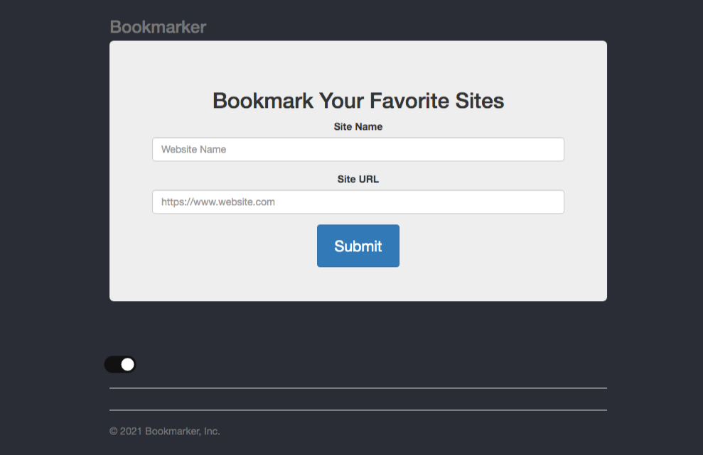

# Bookmarker LocalStorage App

Simple application for bookmarking webistes. This app goes along with the "Learn JavaScript By Building A Bookmarking App" tutorial. It uses localStorage for storing bookmarks. This project was build with vanilla Javascript

<h1 align="center">
  
</h1>

<h1>Dark Mode</h1>

<h1 align="center">
  
</h1>

### Version
1.0.0

### Usage

Just download and open index.html. It is all client side

## 🚀 Technologies

- HTML
- CSS
- JavaScript

## Original project and video: 

* https://github.com/bradtraversy/bookmarker

* https://bityli.com/67ujZ

### Main changes from the original project:

- I use the most updated version of Javascript (ES6, ES7, ES8)
- Removed the function fetchBookmarks on html (onload="fetchBookmarks")
- Use forEach and filter instead the loop for
- Dark Mode

Made with ♥ by [Renan](https://github.com/renantb)
